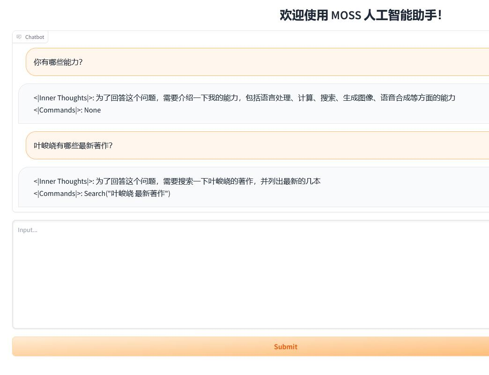
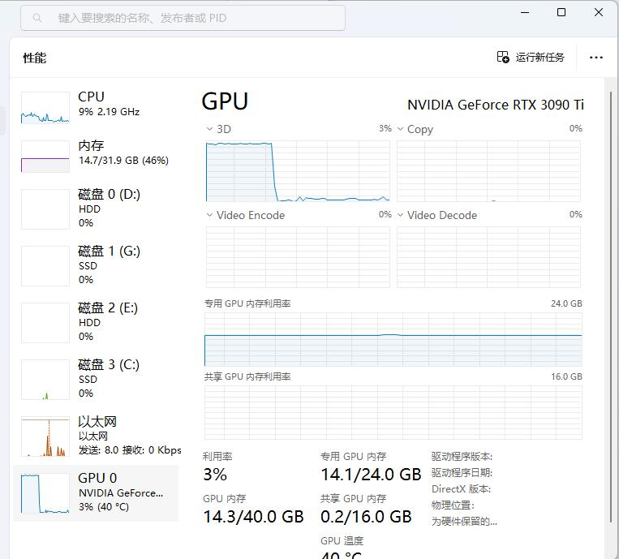

# MOSS-DockerFile

https://hub.docker.com/repository/docker/linonetwo/moss/general

用于在 Docker 里运行复旦的 MOSS 语言模型，使用 GradIO 提供 WebUI。

## Run

### 运行环境

Windows 上 docker 运行环境搭建参考[2022 最新 Docker 和 WSL2 ，炼丹环境配置指南 - 无人知晓的文章 - 知乎](https://zhuanlan.zhihu.com/p/543280130)。然后使用 docker desktop 下载和管理镜像。

最小的 int4 量化版本，需要一个 3090ti，将占用 14GB 显存，并随着上下文增加而增加。

### 下载模型

参考 https://huggingface.co/fnlp/moss-moon-003-sft-plugin-int4

```sh
# Make sure you have git-lfs installed (https://git-lfs.com)
git lfs install
git clone https://huggingface.co/fnlp/moss-moon-003-sft-plugin-int4

# if you want to clone without large files – just their pointers
# prepend your git clone with the following env var:
GIT_LFS_SKIP_SMUDGE=1
```

我个人是先带上 `GIT_LFS_SKIP_SMUDGE=1` 去 `git clone`，来下载 `config.json` 等文件。然后单独用浏览器下载 10GB 的 `pytorch_model.bin` 文件，会比较快。

之后需要将这个 `moss-moon-003-sft-plugin-int4` 文件夹作为 Volume 挂载到 docker 的 `/mnt/llm` 文件夹上。

### 运行 docker

Example shell command to run it in windows11 with WSL2 enabled

```sh
docker run --gpus all -it --volume=C:\Users\linonetwo\Documents\model\LanguageModel:/mnt/llm -d moss:latest
```

My models are inside `C:\Users\linonetwo\Documents\model\LanguageModel`, which includes `C:\Users\linonetwo\Documents\model\LanguageModel\MOSS\moss-moon-003-sft-plugin-int4\pytorch_model.bin`.

If your model are in different location, change the `--volume=xxx:/mnt/llm` part in the command.

In Docker Desktop, it looks like this:


## Build

如果修改了 Docker file，需要重新构建镜像，这样构建：

```shell
docker build -t moss . -f ./moss-int4-cuda117.dockerfile
```

## Screenshots





## FAQ

### Killed

Docker 显示 Killed，一般是因为内存（RAM）不足，改 WSL2 的配置改大提供给虚拟机的内存即可：

参考 https://stackoverflow.com/a/72693871/4617295

### failed to solve with frontend dockerfile.v0

```log
 => ERROR [internal] load metadata for docker.io/nvidia/cuda:11.7.1-cudnn8-devel-ubuntu22.04                                    0.2s
------
 > [internal] load metadata for docker.io/nvidia/cuda:11.7.1-cudnn8-devel-ubuntu22.04:
------
failed to solve with frontend dockerfile.v0: failed to create LLB definition: unexpected status code [manifests 11.7.1-cudnn8-devel-ubuntu22.04]: 403 Forbidden
```

可能需要关掉 buildkit ，参考 https://stackoverflow.com/a/70153060/4617295

### Failed to run image

可能是没填 `ENTRYPOINT`，导致尝试基础镜像执行已被删掉的 `/opt/nvidia/nvidia_entrypoint.sh`

```log
Failed to run image. Error invoking remote method 'docker-run-container': Error: (HTTP code 400) unexpected - failed to create shim task: OCI runtime create failed: runc create failed: unable to start container process: exec: "/opt/nvidia/nvidia_entrypoint.sh": stat /opt/nvidia/nvidia_entrypoint.sh: no such file or directory: unknown
```

补上即可

```dockerfile
ENTRYPOINT ["/usr/bin/python3"]
CMD ["moss_web_demo_gradio.py"]
# ENTRYPOINT ["/usr/bin/env"]
# CMD ["bash"]
```

### moss_web_demo_gradio.py

修改自 https://github.com/OpenLMLab/MOSS/blob/main/moss_web_demo_gradio.py ，那个版本未考虑量化用法，普通人电脑跑不了，故适配了量化用法，并自动修复官方运行 demo 会报的 `name 'autotune' is not defined` 错误。

### GPU no found

关键是带上 `--gpus all` ，即 `docker run --gpus all`

## Credit

参考了 [mortals-debuging/pytorch-docker](https://github.com/mortals-debuging/pytorch-docker)
